# Architecture Document — SZAFIT
**Date:** 2026-06-11  
**Version:** 1.0 (inferred from codebase)  
**Status:** Reflects current production codebase as of audit date

---

## 1. System Architecture Overview

SZAFIT is a **decoupled multi-page web application** with three distinct layers:

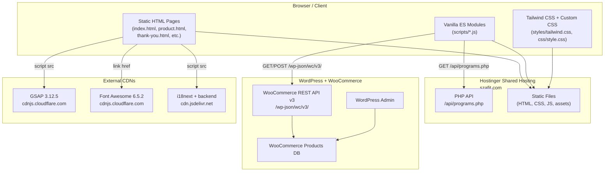

---

## 2. Frontend Architecture

### 2.1 Technology Decisions

| Decision | Choice | Rationale (inferred) |
|----------|--------|----------------------|
| Framework | None (vanilla HTML/JS) | Low complexity site; avoids build overhead |
| Module system | ES Modules (`type="module"`) | Native browser modules; no bundler needed |
| CSS framework | Tailwind CSS v3 | Utility-first; aligns with dark mode, RTL, and responsive requirements |
| Animations | GSAP 3.12.5 | Professional-grade animation; ScrollTrigger for reveal effects |
| Icons | Font Awesome 6.5.2 | Large icon set; CDN delivery |
| i18n | i18next + JSON files | Industry-standard; supports async JSON loading, fallback, events |
| Typography | Changa (self-hosted) | Arabic-Latin variable font; avoids Google Fonts latency |
| Currency | Custom SAR SVG font + inline SVG | Saudi Riyal symbol not in Unicode web fonts |
| Dark mode | Tailwind `class` strategy | Toggled via `<html class="dark">`; persisted in `localStorage` |

### 2.2 Page Structure

Each HTML page follows this consistent structure:

```html
<html lang="ar" dir="rtl">
<head>
  <!-- @font-face declarations (Changa, 7 weights) -->
  <!-- tailwind.css -->
  <!-- css/style.css -->
  <!-- saudi-riyal-font/style.css -->
  <!-- Font Awesome CDN <link> -->
</head>
<body>
  <!-- Pre-init dark mode script (inline, prevents FOUC) -->
  <!-- Background grid layer (fixed, z=-10) -->
  <nav> ... </nav>
  <main> ... </main>
  <footer> ... </footer>

  <!-- GSAP CDN scripts -->
  <!-- i18next CDN scripts -->
  <script src="scripts/i18n-config.js"></script>
  <script src="scripts/checkout-modal.js"></script>
  <script type="module" src="scripts/index.js"></script>  <!-- homepage only -->
</body>
</html>
```

**Key observation:** `i18n-config.js` and `checkout-modal.js` are loaded as classic scripts (non-module), while `index.js` uses ES modules. This creates a global/module split that is managed via `window.*` exports from `i18n-config.js`.

### 2.3 Script Architecture

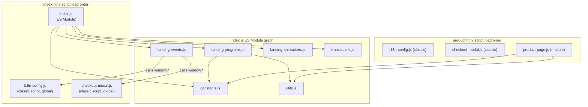

### 2.4 State Management

There is no formal state management library. State is held in:

| State | Location | Persistence |
|-------|----------|-------------|
| Current language (`ar`/`en`) | `state.lang` in `index.js` + `localStorage.lang` | `localStorage` |
| Current theme (`light`/`dark`) | `state.theme` in `index.js` + `localStorage.theme` | `localStorage` |
| Loaded programs data | `programsData` in `index.js` closure | In-memory (page lifetime) |
| Current product (`product.html`) | `window.currentProduct` | In-memory |
| Checkout state | `checkoutState` in `checkout-modal.js` | In-memory |
| i18n instance | `window.i18n` (i18next) | In-memory + `localStorage.lang` |

### 2.5 i18n Architecture (Dual System — Known Issue)

```mermaid
graph LR
    subgraph "System A (i18next)"
        A1["locales/ar.json"]
        A2["locales/en.json"]
        A3["i18n-config.js\n(i18next instance)"]
        A4["data-i18n DOM attributes\n(updated on language change)"]
        A1 & A2 -->|HTTP fetch| A3
        A3 -->|updateDataI18nElements()| A4
    end

    subgraph "System B (inline object)"
        B1["translations.js\n(AR+EN object)"]
        B2["landing-events.js\n(applyLanguage)"]
        B3["landing-programs.js\n(renderPrograms)"]
        B4["checkout-modal.js\n(checkoutTranslations)"]
        B1 --> B2
        B1 --> B3
    end

    style A3 fill:#d4edda
    style B4 fill:#fff3cd
```

**Problem:** Text can diverge between the two systems. System A is the right long-term approach; System B should be removed.

### 2.6 Component Hierarchy (Homepage)

```
index.html
├── <nav>
│   ├── NavBrand (logo + tagline)
│   ├── DesktopLinks (Programs, Method, App, Stories)
│   ├── NavActions (langToggle, themeToggle, navCTA, mobileToggle)
│   └── MobileMenu (hidden, drawer)
│
├── <main>
│   ├── HeroSection
│   │   ├── BackgroundOrbs (parallax)
│   │   ├── HeroContent (headline, CTA buttons, social proof)
│   │   ├── HeroCard (image, stats, checklist)
│   │   └── HeroMarquee (GSAP infinite scroll)
│   │
│   ├── ProgramsSection (#programs)
│   │   └── #programsGrid (dynamically rendered program cards)
│   │       └── ProgramCard ×6 (cover, title, price, summary, requirements, CTA link)
│   │
│   ├── StatsStrip (#stats)
│   │   └── StatItem ×3 (animated counter)
│   │
│   ├── MethodSection (#method)
│   │   ├── MethodPoints ×4 (icon + text cards)
│   │   └── PerformanceCard (image + live stats bars)
│   │
│   ├── AppSection (#app)
│   │   ├── AppFeatureList ×4
│   │   └── AppPhoneMockup (CSS-only phone UI + stats)
│   │
│   ├── StoriesSection (#stories)
│   │   └── StoriesLoop (GSAP infinite scroll)
│   │       └── StoryCard ×7 (avatar, name, role, quote)
│   │
│   └── FinalCTA (#final)
│       └── CTACard (heading, desc, WhatsApp button)
│
└── <footer>
    └── SocialLinks (Instagram, Twitter, YouTube, TikTok)
```

### 2.7 Checkout Modal Architecture

The checkout modal is not part of the page DOM at load time. It is injected as a string of HTML and then activated:

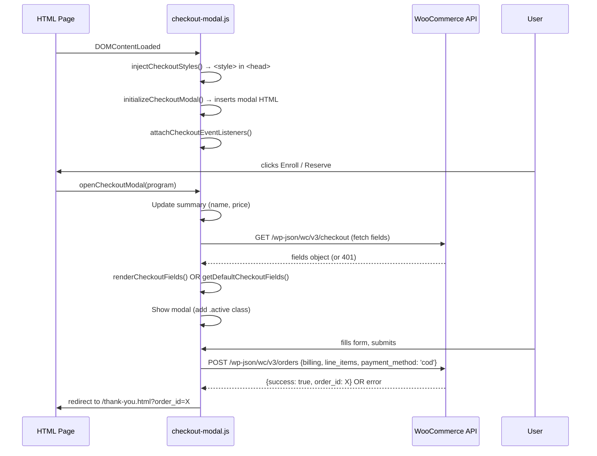

---

## 3. WordPress / Backend Architecture

### 3.1 WordPress Setup

```
z.szafit.com
├── /wp-admin/              WordPress dashboard (content management)
├── /wp-content/
│   └── /uploads/2026/02/   Product images
├── /wp-json/
│   └── /wc/v3/             WooCommerce REST API
│       ├── /products        GET all products
│       ├── /products/{id}   GET single product
│       ├── /orders          POST create order
│       └── /checkout        GET checkout fields
└── WooCommerce plugin       Order management, product catalog
```

### 3.2 Data Model (WooCommerce Product)

```
WooCommerce Product {
  id:                 integer          (1-6 for current programs)
  name:               string           "English Name اسم عربي" (bilingual, single field)
  description:        text             Arabic description with embedded requirements (📌 pattern)
  short_description:  text             Arabic one-liner
  price:              string           "99" / "149" / "600" etc. (SAR)
  regular_price:      string           Same as price (no discounts currently)
  images:             [{src: URL}]     Hosted at z.szafit.com/wp-content/uploads/
  tags:               [{name: string}] Foundation / Sculpt / Burn / VIP / Postpartum / Challenge
  meta_data:          [{key, value}]   Optional: name_ar, description_ar, requirements_ar/en, etc.
}
```

### 3.3 PHP API (`api/programs.php`)

A simple PHP script that:
1. Sets CORS headers (`Access-Control-Allow-Origin: *`)
2. Returns a hardcoded JSON array of 6 programs in WooCommerce product format
3. Has no database connection — data is fully hardcoded

**Rationale:** Provides same-origin data access without CORS or auth complexity of WooCommerce REST API.

**Risk:** Manual sync required with WooCommerce. Any WC change must be mirrored here.

---

## 4. API Architecture

### 4.1 Endpoints Map

| Endpoint | Direction | Auth | Used By | Purpose |
|----------|-----------|------|---------|---------|
| `GET /api/programs.php` | Frontend→PHP | None | `landing-programs.js` | Program list (primary) |
| `GET z.szafit.com/wp-json/wc/v3/products` | Frontend→WC | None (!) | `landing-programs.js` | Program list (fallback) |
| `GET z.szafit.com/wp-json/wc/v3/products/{id}` | Frontend→WC | None (!) | `product-page.js` | Single program |
| `GET z.szafit.com/wp-json/wc/v3/checkout` | Frontend→WC | None (!) | `checkout-modal.js` | Checkout fields |
| `POST z.szafit.com/wp-json/wc/v3/orders` | Frontend→WC | None (!) | `checkout-modal.js` | Create order |

**All WooCommerce calls are unauthenticated** — this is a critical gap. WC REST API requires authentication for most operations by default.

### 4.2 Data Flow Diagram

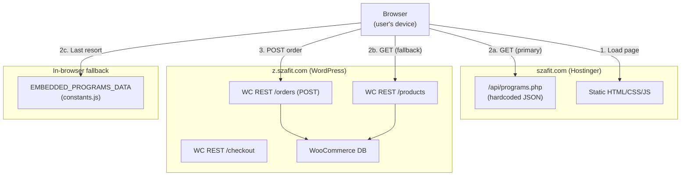

---

## 5. Data Flow Diagrams

### 5.1 Program Loading Flow

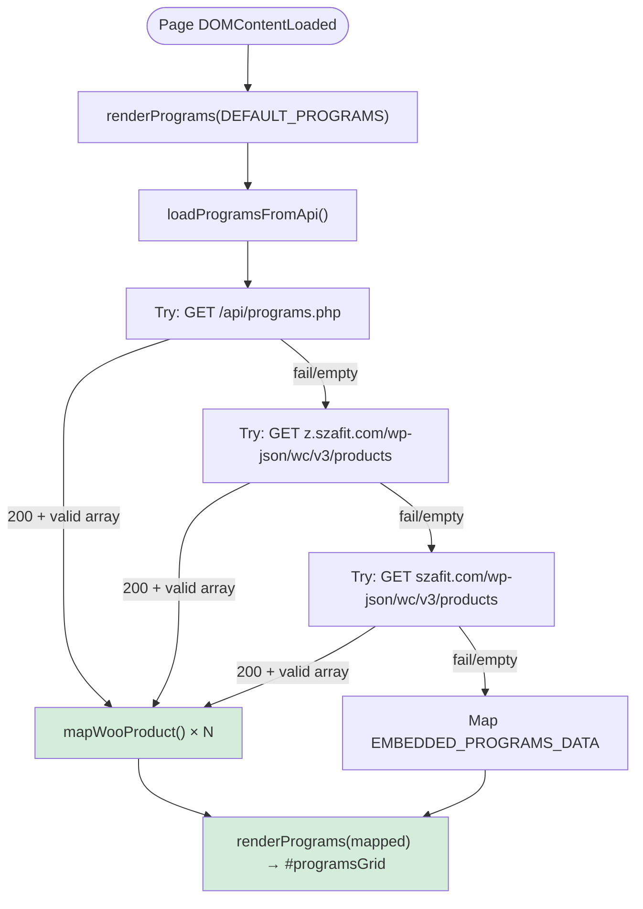

### 5.2 Checkout Flow

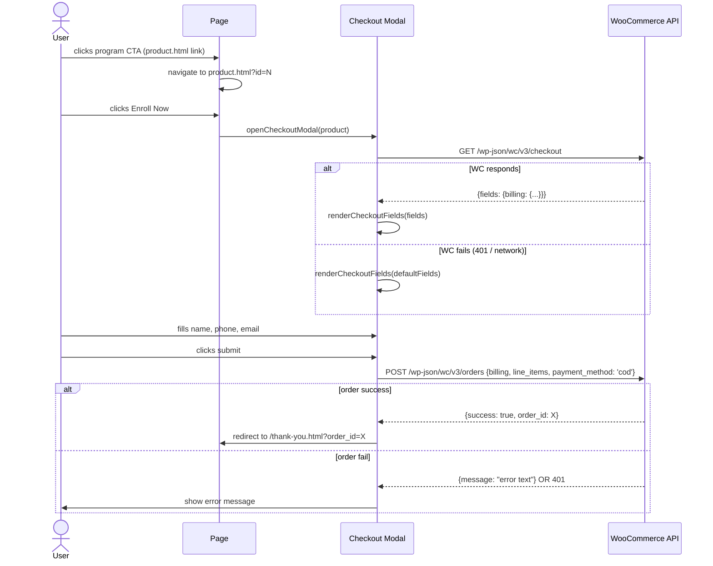

### 5.3 Language Switch Flow

```mermaid
flowchart LR
    Button["User clicks EN/AR toggle"]
    --> Update1["state.lang = newLang"]
    --> LS["localStorage.lang = newLang"]
    --> HTML["<html lang/dir update"]
    --> I18n["i18n.changeLanguage()\n→ updateDataI18nElements()"]
    --> Event["dispatch 'languageChanged' event"]
    --> Re1["landing-events.js:\napplyLanguage() re-renders data-i18n"]
    --> Re2["landing-programs.js:\nrenderPrograms() re-renders cards"]
    --> Re3["product-page.js:\nrenderProduct() re-renders detail"]
    --> Re4["checkout-modal.js:\nupdateCheckoutModalLanguage()"]
```

---

## 6. Folder Ownership

| Folder | Owner / Purpose | Edit Frequency |
|--------|-----------------|----------------|
| `/` (root HTML files) | Developer | Low — page structure is stable |
| `scripts/` | Developer | High — business logic |
| `css/style.css` | Developer | Medium — component and theme styles |
| `styles/` | Build output | Never edit manually — generated by Tailwind |
| `api/` | Developer | Low — only when programs change |
| `locales/` | Developer / Copywriter | Medium — new features add keys |
| `assets/images/` | Designer | Low — static site images |
| `assets/fonts/` | Designer | Very low — font choices are stable |
| `vendor/` | Unknown | Do not touch — incomplete copies |
| `docs/` | Developer | Medium — reference docs |
| `tailwind.config.js` | Developer | Low — design token changes |
| `package.json` | Developer | Very low |

---

## 7. Component Hierarchy Diagram

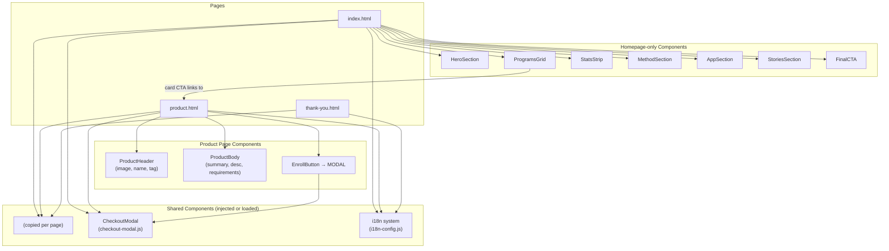

---

## 8. Route Hierarchy

```
szafit.com/
├── /                           → index.html   (SPA-like single-page with anchor sections)
│   ├── #programs               (programs section — anchor scroll)
│   ├── #method                 (method section)
│   ├── #app                    (app section)
│   ├── #stories                (testimonials)
│   └── #final                  (final CTA)
│
├── /product.html?id={1-6}      → product.html (dynamic render based on query param)
├── /thank-you.html?order_id=N  → thank-you.html (reads order ID from URL)
├── /404.html                   → 404 error page
│
├── /api/programs.php           → PHP JSON API (server route)
│
├── [ORPHAN CANDIDATES — review status]
│   ├── /checkout.html          → checkout.html
│   ├── /products.html          → products.html
│   ├── /product-single.html    → product-single.html
│   ├── /about.html             → about.html
│   ├── /success-stories.html   → success-stories.html
│   ├── /booking.html           → booking.html
│   ├── /contact.html           → contact.html
│   └── /app.html               → app.html
│
└── [REMOVE FROM PRODUCTION]
    └── /test.html
```

---

## 9. Technical Debt

### Severity: Critical

| Debt | Impact | Effort to Fix |
|------|--------|---------------|
| SFTP credentials in git | Security — server compromised | Low (rotate + gitignore) |
| WC orders called without auth | Commerce broken | Medium (PHP proxy) |
| No `.gitignore` | Accidental secret commits | Trivial |

### Severity: High

| Debt | Impact | Effort to Fix |
|------|--------|---------------|
| Dual i18n systems | Content divergence, maintenance overhead | Medium |
| Triple program data sources | Data sync risk, admin confusion | Medium-High |
| `SAR_ICON_SVG` copy-pasted 3× | Bug if SVG needs updating | Low |
| Compiled CSS in git | Merge conflicts, bloated history | Low |

### Severity: Medium

| Debt | Impact | Effort to Fix |
|------|--------|---------------|
| `window.state` / `window.elements` globally exposed | State corruption risk | Low |
| `AbortController` shared across retry loop | First timeout kills remaining retries | Low |
| Inline onclick on WhatsApp CTA | Inconsistent pattern, minor CSP risk | Trivial |
| No analytics | Cannot measure business performance | Low (install GA4) |
| No robots.txt / sitemap.xml | SEO gap | Trivial |
| No Open Graph tags | Poor social sharing | Low |
| Inline `<style>` from checkout modal | Rendering performance, maintenance | Low |
| Pages not linked in nav | Undiscoverable pages | Low |

### Severity: Low

| Debt | Impact | Effort to Fix |
|------|--------|---------------|
| Hardcoded API URLs | Environment-specific code | Low |
| 7 font weights loaded (possibly unused) | Bundle size | Low (audit + prune) |
| vendor/ incomplete copies | Wasted disk space | Trivial |
| test.html on production | Exposed dev scratch | Trivial |
| default.php in project root | Confusion | Low |

---

## 10. Refactoring Opportunities

### Opportunity 1: Consolidate i18n
**Current:** Two parallel systems  
**Target:** One system — i18next with JSON files only  
**Steps:**
1. Audit all callers of `translations.js` — `landing-events.js:applyLanguage()`, `landing-programs.js:renderPrograms()`
2. Add missing keys to `locales/ar.json` and `locales/en.json`
3. Replace `translations[lang][key]` lookups with `i18n.t(key)` calls
4. Delete `translations.js`

### Opportunity 2: Centralize API base URL
**Current:** `z.szafit.com` hardcoded in 3 files  
**Target:** Single `config.js` or top of `constants.js`  
```js
// constants.js
export const WC_BASE = '/api'; // or 'https://z.szafit.com/wp-json/wc/v3'
```

### Opportunity 3: WooCommerce auth via PHP proxy
**Current:** Browser calls WC API directly (no auth)  
**Target:** Browser calls `/api/create-order.php` → PHP holds WC credentials → PHP calls WC  
```
Browser → POST /api/create-order.php {billing, product_id}
  → PHP: reads WC_KEY and WC_SECRET from environment
  → PHP: POST z.szafit.com/wp-json/wc/v3/orders
  → PHP: returns {success, order_id} to browser
```

### Opportunity 4: Eliminate SAR_ICON_SVG duplication
**Current:** Identical SVG defined in `constants.js`, `checkout-modal.js`, `checkout.js`  
**Target:** Export only from `constants.js`:
```js
// checkout-modal.js — remove local definition, import instead
import { SAR_ICON_SVG } from './constants.js';
```
**Note:** `checkout-modal.js` is a classic script (non-module); would require converting to a module or using a shared global.

### Opportunity 5: Move modal styles to `css/style.css`
**Current:** `injectCheckoutStyles()` in `checkout-modal.js` appends a `<style>` block on every page  
**Target:** Move all modal CSS rules to `css/style.css` and remove `injectCheckoutStyles()`

---

## 11. Suggested Future Architecture

As the site grows (more programs, more pages, potential subscription model), a gradual evolution path:

### Stage 1: Secure Current Stack (Months 1–2)
Keep vanilla HTML/JS. Add:
- PHP proxy for WC orders
- Analytics
- Environment config object
- Single i18n system

```
Browser → szafit.com (Hostinger)
  ├── Static HTML/CSS/JS (served as-is)
  └── /api/
       ├── programs.php     (read: proxy to WC)
       └── create-order.php (write: proxy to WC with server-side auth)
           → z.szafit.com/wp-json/wc/v3/orders (auth via Consumer Key)
```

### Stage 2: Add SSR for SEO (Months 3–4)
If SEO becomes important (organic search channel), consider:
- **Option A:** Astro.js — island architecture, outputs static HTML, good for mostly-static + interactive islands
- **Option B:** Pre-render program cards server-side in PHP and embed in HTML (simpler, no new framework)
- Keep WooCommerce as headless backend

### Stage 3: Framework Migration (If Needed, Months 6+)
Only if product complexity grows significantly:
- **Next.js** (recommended if React knowledge available) — SSR + client-side hydration + API routes replace PHP
- **Nuxt.js** — Vue equivalent
- **Migration approach:** Start with `index.html` as a Next.js App Router page; port scripts one by one

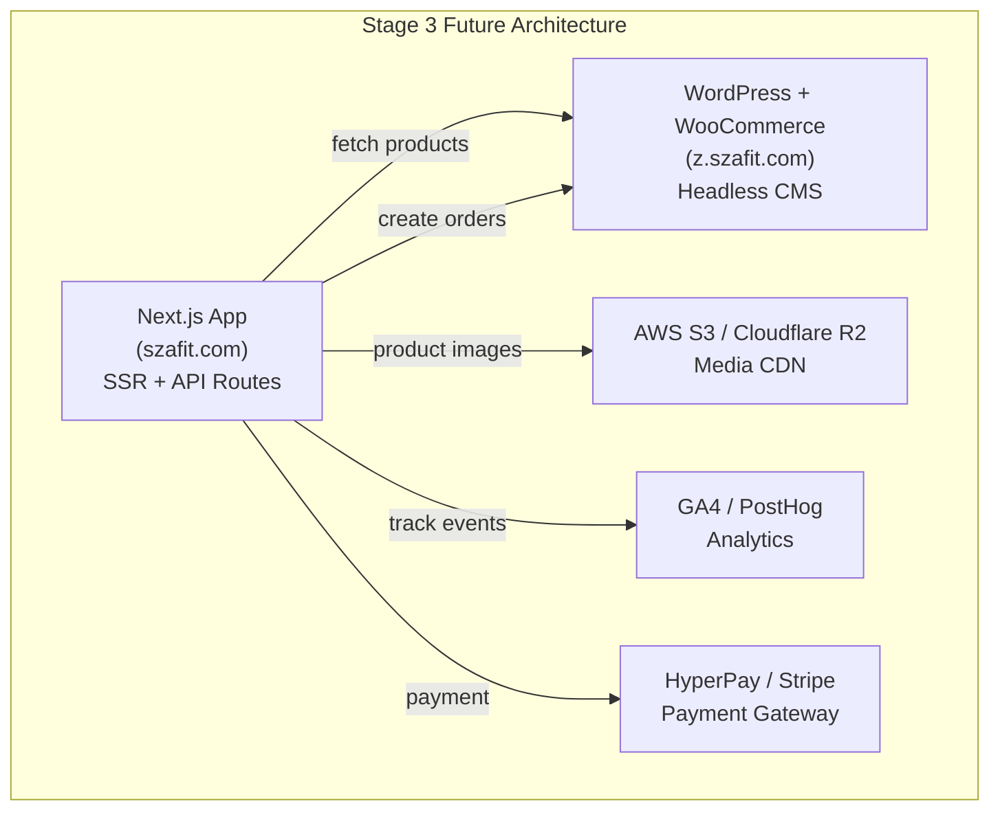

---

## 12. Security Architecture

### Current Security Posture

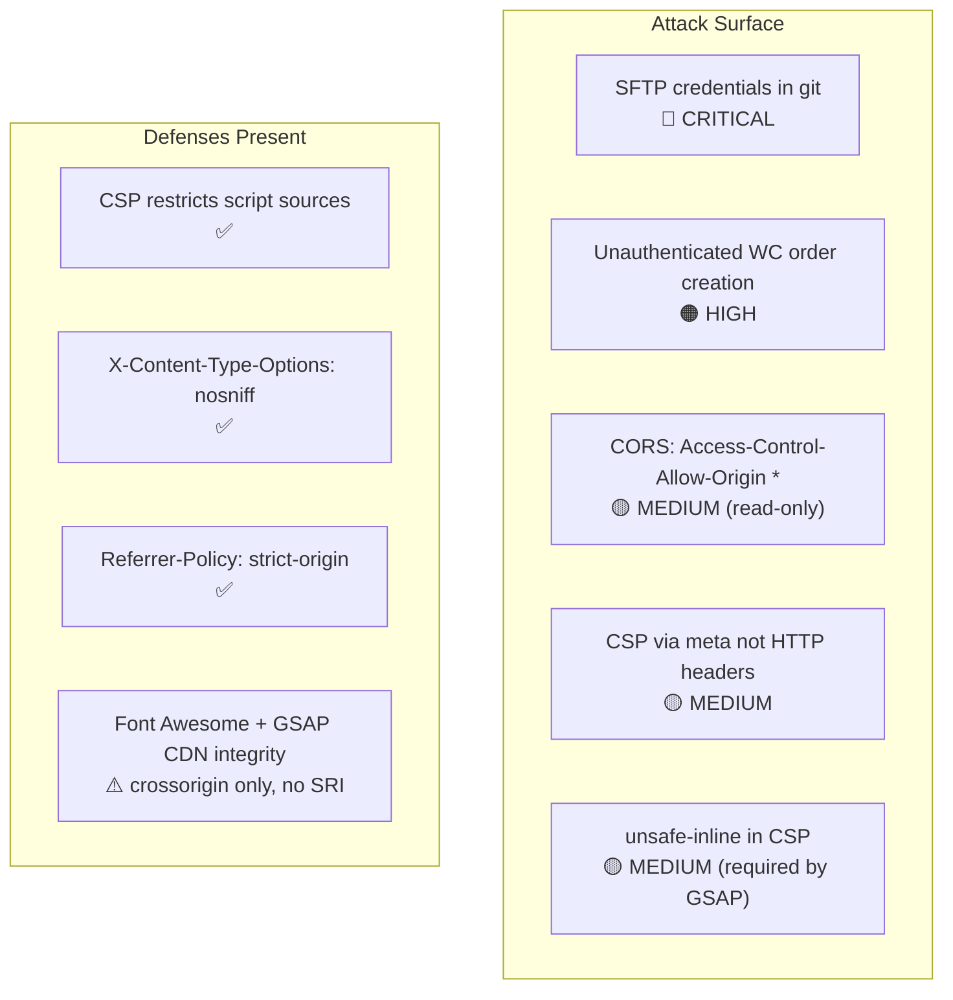

### Recommended Security Improvements

1. **Immediate:** Rotate SFTP credentials; add `.vscode/sftp.json` to `.gitignore`
2. **High:** Implement PHP proxy for order creation with server-side WC credentials
3. **Medium:** Move CSP to `.htaccess` HTTP headers
4. **Medium:** Add `integrity` (SRI) hashes to CDN `<script>` and `<link>` tags
5. **Low:** Add rate limiting in `api/programs.php` if load grows

---

## 13. Performance Architecture

### Current Load Sequence

```
1. HTML parse begins
2. Pre-init dark mode script runs (inline, synchronous) → prevents FOUC
3. @font-face CSS parsed → Changa font loads async (font-display: swap)
4. tailwind.css loaded (render-blocking until loaded)
5. css/style.css loaded (render-blocking)
6. saudi-riyal-font/style.css loaded (render-blocking)
7. Font Awesome CSS loaded (CDN, render-blocking)
--- First Contentful Paint possible here ---
8. GSAP JS loaded (CDN)
9. ScrollTrigger JS loaded (CDN)
10. i18next JS loaded (CDN)
11. i18next-http-backend JS loaded (CDN)
12. i18n-config.js runs → fetches locales/ar.json (async)
13. checkout-modal.js runs → injects styles + modal HTML
14. index.js (module) runs → DOM ready → renderPrograms(DEFAULT) → API fetch → re-render
--- Page fully interactive ---
```

### Performance Risks
- 4 render-blocking CSS files before FCP
- 4 CDN JS files loaded sequentially
- First API call can add 1-7s to program card render

### Performance Quick Wins
1. Combine `css/style.css` into `styles/tailwind-input.css` (one CSS file)
2. Preconnect to CDN origins: `<link rel="preconnect" href="https://cdnjs.cloudflare.com">`
3. Subset Changa to 3-4 weights actually used (remove 200, 300, 500 if unused)
4. Add `fetchpriority="high"` to hero image (already present ✅)
5. Embed first 6 programs in page HTML (avoid JS-render delay for LCP content)

---

## 14. Deployment Architecture

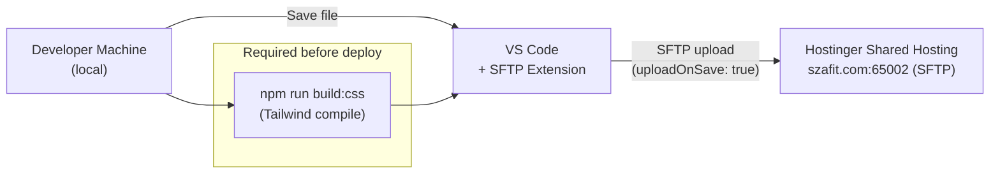

**Risk:** `uploadOnSave: true` means every file save — including mid-edit states — goes live immediately. This is a high-risk deployment strategy for a production site.

**Recommended improvement:** Disable `uploadOnSave`; adopt explicit deploy step:
```bash
npm run build:css && sftp-deploy  # or rsync / GitHub Actions
```

---

## 15. Known Architecture Limitations

| Limitation | Description | Workaround | Future Fix |
|------------|-------------|------------|------------|
| No SSR | Programs not in initial HTML; crawlers may miss them | Embed fallback data in `<noscript>` or page HTML | Switch to Astro or Next.js |
| No bundler | No tree-shaking, code splitting, or minification of JS | Acceptable at current scale | Add Vite if complexity grows |
| No TypeScript | No compile-time type safety | Code review discipline | Add JSDoc types or migrate to TS |
| No automated tests | No unit or E2E tests | Manual test checklist in `docs/TEST-CHECKLIST.md` | Add Playwright E2E tests |
| Shared hosting limits | Limited server-side compute; no Node.js runtime | PHP-only server logic | Upgrade to VPS if needed |
| WC on subdomain | CORS required for all API calls | PHP same-origin proxy (planned) | — |
| No CI/CD | Manual deployment; no automated quality gates | SFTP extension | GitHub Actions on push |
